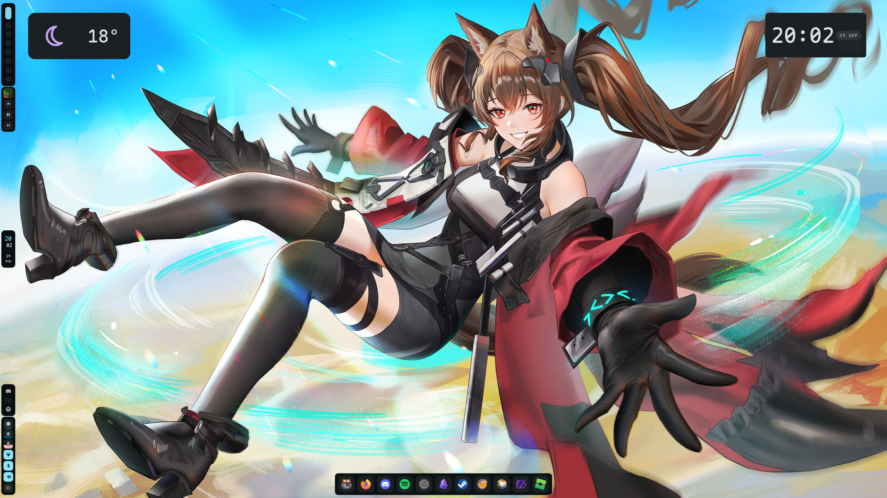
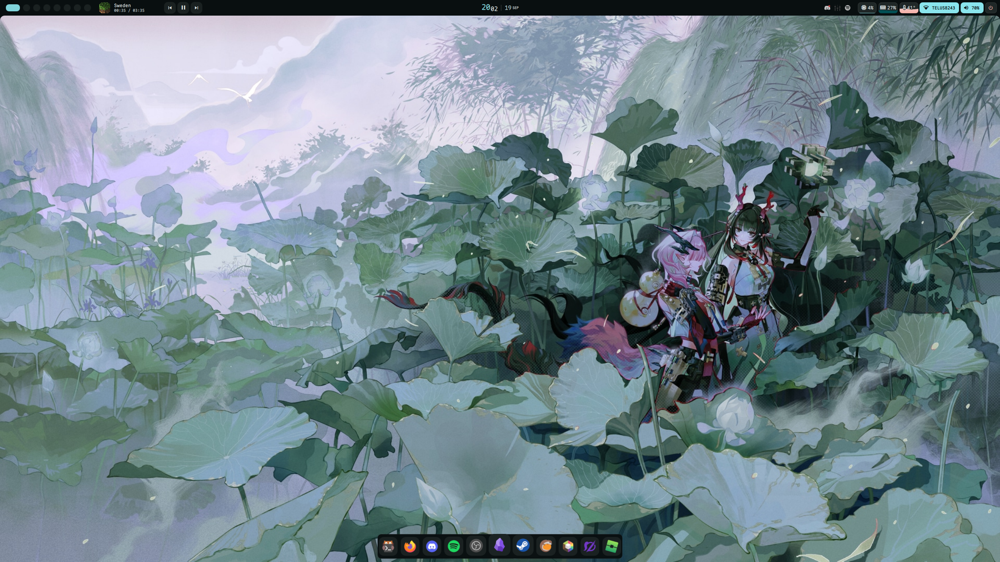
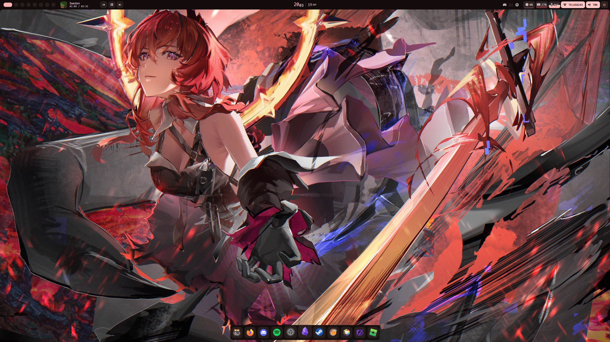
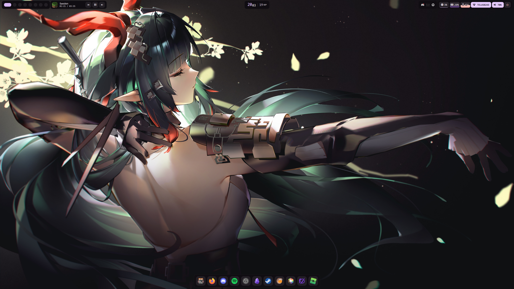

# 🖼️ Wallpapers

A small, hand-picked collection of anime wallpapers for desktop setups.

  

Collections · Preview · Usage · Credits

</div>
# 📦 Collections
Folder	Description
Endfield-Wallpapers/	Arknights: Endfield wallpapers

More collections will be added over time.

🖼 Preview (using [serpantinum]([https://example.com](https://github.com/ilyamiro/serpantinum)) shell by @ilyamiro)
<!-- Replace the file names below with real images from your repo. Tip: for faster page loads, add small thumbnails (~800px wide) in a `previews/` folder and link each one to its full-resolution file. --> <div align="center">
	
	
	
</div>
# 🚀 Usage
Get the wallpapers

Grab everything:

```bash
git clone https://github.com/joshuapieroway/Wallpapers.git
```

Or skip the history for a smaller download:

```bash
git clone --depth 1 https://github.com/joshuapieroway/Wallpapers.git
```

Just want one? Open the image on GitHub, click Download raw file, and you're set.
